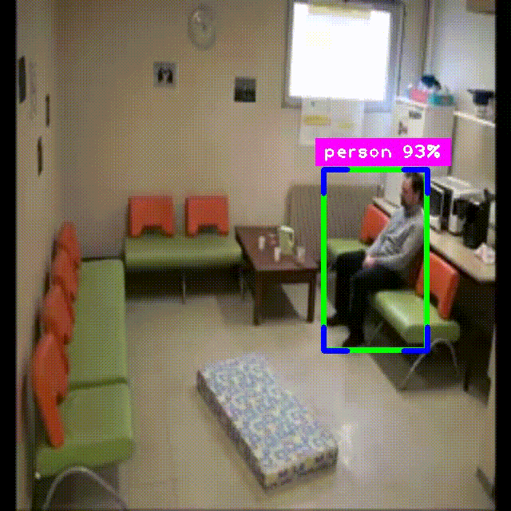

# Human Abnormality Detection System

## Overview
The Human Abnormality Detection System is a Python-based application that utilizes YOLOv8 (via the Ultralytics library) for real-time object detection in video streams. It primarily focuses on detecting human falls by analyzing bounding boxes, aspect ratios, velocity, and angle changes. The system processes input videos and outputs annotated results, making it suitable for surveillance, elderly care, and security applications.

This project can be enhanced with additional features to make it more robust, scalable, and practical for real-world deployment.

## Features

### Core Features
- **Fall Detection**: Detects potential falls in video feeds using YOLOv8 object detection.
- **Real-Time Processing**: Processes video frames in real-time, annotating detections with bounding boxes and labels.
- **Output Video Generation**: Saves processed videos with annotations to `output.avi`.
- **Confidence Thresholding**: Only processes detections with confidence > 80% for persons.
- **Metrics Calculation**: Computes aspect ratio, velocity, angle changes, and other heuristics for fall detection.

### Suggested Enhancements
To expand the system's capabilities, the following features can be added:

1. **Real-Time Alerts and Notifications**
   - Send email, SMS, or push notifications upon detecting abnormalities.
   - Integrates libraries like `smtplib` or `twilio` for alerts.
   - Enhances proactive monitoring for critical scenarios.

2. **Multi-Person Tracking and ID Assignment**
   - Assign unique IDs to individuals using tracking algorithms (e.g., SORT or DeepSORT).
   - Prevents false positives in crowded scenes and tracks interactions.
   - Improves accuracy for multi-person environments.

3. **Detection of Additional Abnormalities**
   - Expand detection to include fighting, running, or unusual poses using pose estimation (e.g., MediaPipe).
   - Adds rules for anomaly detection based on motion patterns.
   - Broadens the system's scope beyond falls.

4. **Web-Based Dashboard or GUI**
   - Create a user-friendly interface (using Flask or Streamlit) for live video viewing, logs, and configuration.
   - Allows non-technical users to interact with the system.
   - Includes video upload and threshold adjustments.

5. **Logging and Reporting**
   - Implement structured logging for detections, timestamps, and metrics.
   - Generate reports (CSV/PDF) and store data in a database (e.g., SQLite).
   - Enables historical analysis and performance tracking.

6. **Integration with Cameras and IoT Devices**
   - Support live camera feeds (IP cameras, webcams).
   - Enables remote monitoring and multi-camera setups.
   - Adds edge deployment options for low-power devices.

7. **Performance Optimization and Model Customization**
   - Fine-tune YOLO models on custom datasets for better accuracy.
   - Add FPS monitoring, GPU acceleration, and model quantization.
   - Optimizes for resource-constrained environments.

8. **Privacy and Security Features**
   - Implement face blurring or anonymization to protect identities.
   - Add user authentication and encrypted logs.
   - Ensures compliance with privacy regulations.

9. **Automated Testing and Validation**
   - Add unit and integration tests using `pytest`.
   - Validate against ground-truth datasets for precision/recall.
   - Improves reliability and maintainability.

10. **Scalability and Deployment Options**
    - Containerize with Docker for easy deployment.
    - Support cloud integration (AWS/GCP) and batch processing.
    - Adds REST API endpoints for external integrations.

## Installation

1. **Clone or Download the Repository**:
   - Ensure the project folder `Human_Abnormality_Detection/` is in your working directory.

2. **Install Dependencies**:
   - Run the following command to install required packages:
     
```
     pip install -r requirements.txt
     
```
   - For enhancements, additional libraries may be needed (e.g., `twilio` for SMS, `flask` for web dashboard). Install them as required.

3. **Download YOLO Model**:
   - The `yolov8s.pt` model is included. If needed, download a custom model from Ultralytics.

## Usage

1. **Prepare Input Video**:
   - Place your input video (e.g., `video.mp4` or `video_55.avi`) in the project directory.

2. **Run the Detection Script**:
   - Execute the main script:
     
```
     python main.py
     
```
   - The script will process the video and save the output to `output.avi`.

3. **View Results**:
   - Open `output.avi` to see annotated detections.
   - Press 'q' in the display window to exit.

4. **Customization**:
   - Adjust thresholds (e.g., `velocity_threshold`, `aspect_ratio_threshold`) in `main.py` for fine-tuning.
   - For enhancements, modify the script or add new modules as described.

## Requirements
- Python 3.7+
- Libraries: ultralytics, cvzone, opencv-python
- Hardware: GPU recommended for faster inference (optional)

## Project Structure
- `main.py`: Main detection script.
- `classes.txt`: List of COCO class names.
- `requirements.txt`: Python dependencies.
- `yolov8s.pt`: Pre-trained YOLOv8 model.
- `video.avi`: Sample input video.
- `output.avi`: Processed output video with annotations.
- `input_video.gif`: Input video in GIF format.
- `output_video.gif`: Output video in GIF format.

## Demo Videos

### Input Video
Watch the original input video to see the raw footage before detection:


### Output Video
Watch the processed output video with fall detection annotations:



> **Note:** The output video shows real-time fall detection with:
> - Green bounding boxes around detected persons
> - "Fall Detected" red alerts when falls are identified
> - Confidence percentages displayed for each detection

---

## Contributing
- Fork the repository and submit pull requests for enhancements.
- Ensure code follows PEP8 standards and includes tests.

## License
This project is open-source. Use at your own risk.

## Future Improvements
- Implement the suggested enhancements incrementally.
- Test on diverse datasets for better generalization.
- Explore integration with AI frameworks like TensorFlow or PyTorch for advanced features.
